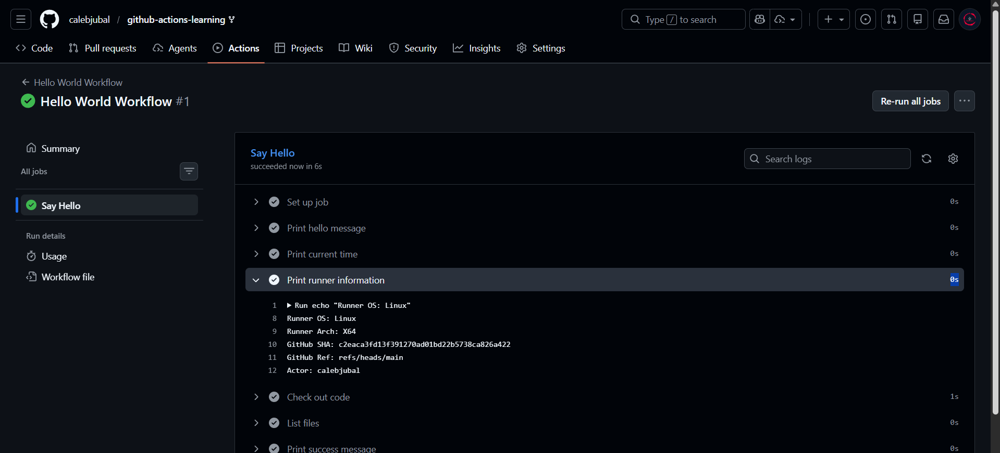
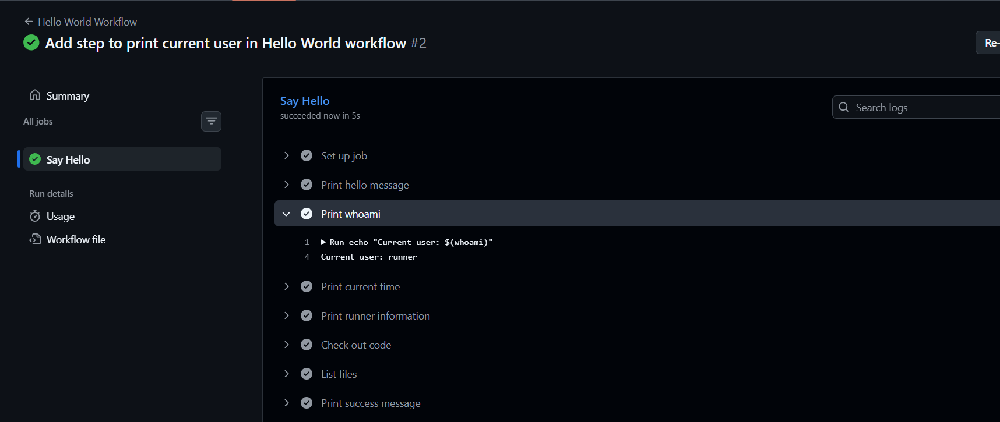
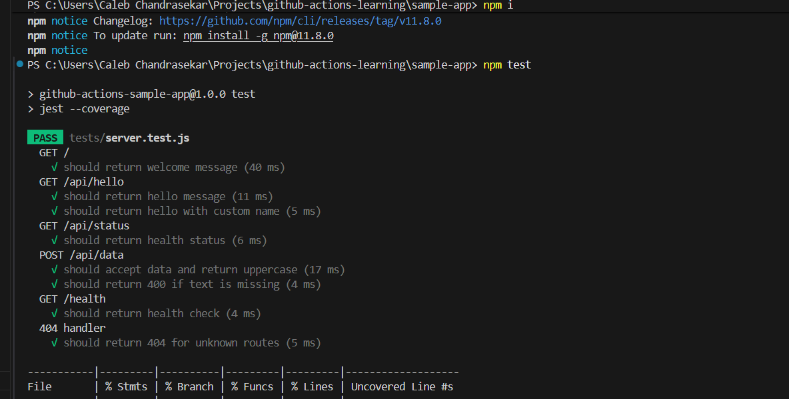
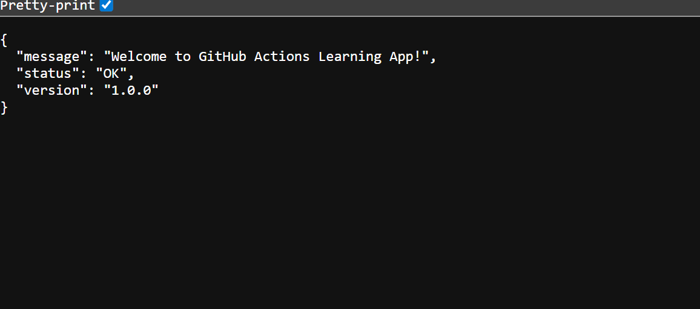

## Submission for beginner badge

- [x] Task 1: Hello World workflow running ✅

- [x] Task 2: Workflow triggered by push event ✅

- [x] Task 3: Local tests passing with npm test ✅

npm test - output:

https://localhost:3000 display:

