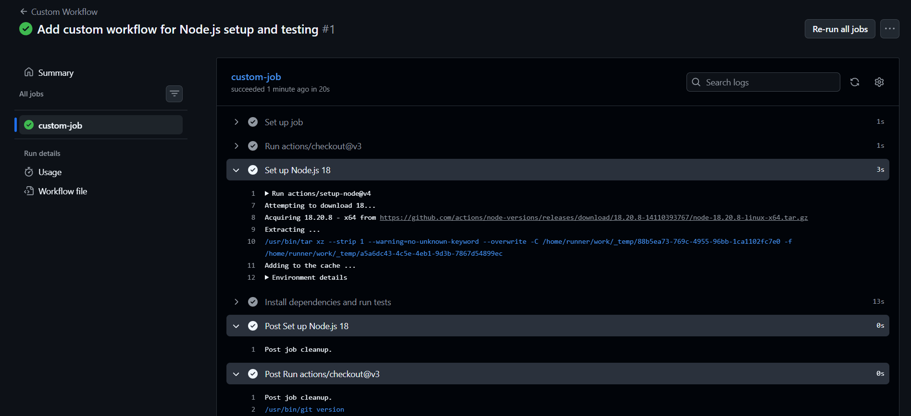
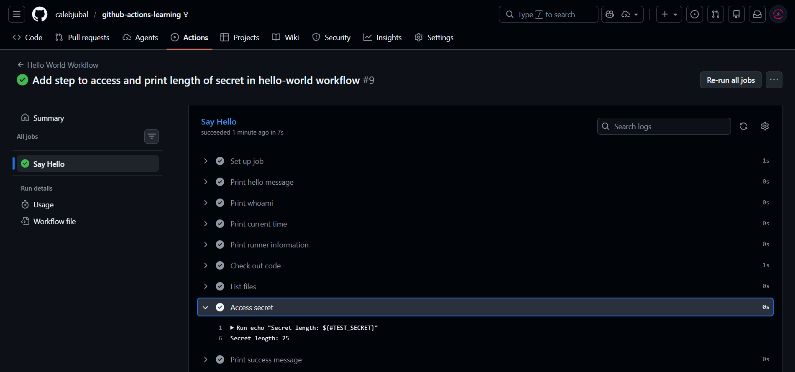
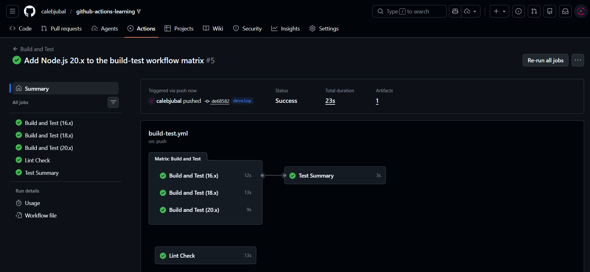

# ⭐ Intermediate Badge Submission - Caleb Chandrasekar

**Date:** February 2026
**Status:** Submitted for Review

## Tasks Completed

- [x] Task 4: Create a Custom Workflow
- [x] Task 5: Add Environment Variables
- [x] Task 6: Use GitHub Secrets
- [x] Task 7: Matrix Testing

## Evidence

#### Task 4: Create a Custom Workflow

#### Task 5: Add Environment Variables

#### Task 6: GitHub Secrets

#### Task 7: Matrix Testing

### Workflow Details
- Branches: develop
- Node versions tested: [16.x, 18.x, 20.x]
- All tests: PASSING ✅

---

Submitted & ready for review! ✅